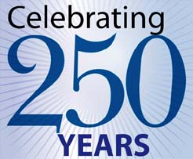

The church service to celebrate 250 years since the founding of Brucefield Church takes place on Sunday 11 September at 11 am.

 

 

Any member able to attend is asked to assemble at the front of the Church (East Main Street) for 10.45 am and we envisage the service being finished around 12 noon.  We ask that full uniform is worn, including necker and dark, school trousers and shoes.

 

Brucefield Church is the sponsoring organisation for the Scout Group and is very generous in the support it gives the Group.  A strong turnout at this event would be very much appreciated.
