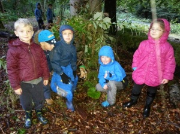
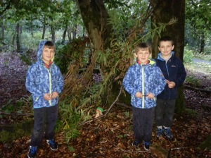
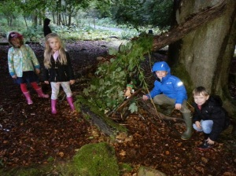
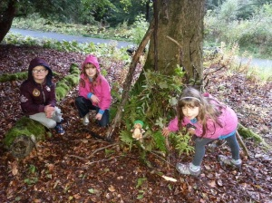
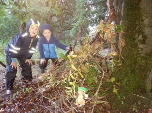

Well done to all the Beavers who came to Polkemmet Country Park on Thursday to do some bivouac building.  This was the final programme needed to gain the Adventure Challenge Award.

The weather could have been a little kinder but everyone dressed appropriately and much fun was had building bivvies under the trees and enjoying the adventure play park when the rain went off.  Well done everyone!

