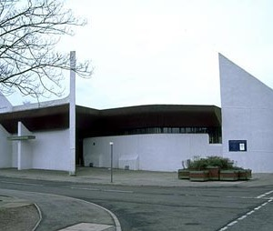

Takes place this Sunday. We are gathering at Whitburn Bowling Club at 10.15 am for a 10.30 am departure. We hope to be back at the Bowling Club around 12.15 pm, after the church service.

Everyone is asked to wear full uniform and a collection will be taken during the service.

**We know everyone's busy. We know parades and services are perhaps seen as a less exciting activity compared to many other things we do. But, they are part of what we do, part of being a Scout, and we ask that everyone makes a real effort to attend. We thank parents for helping (and perhaps cajoling) their child to do so.**

Attendance at the District Parade at the end of April was disappointing across the Sections. An improvement would be brilliant and appreciated. Many thanks.

