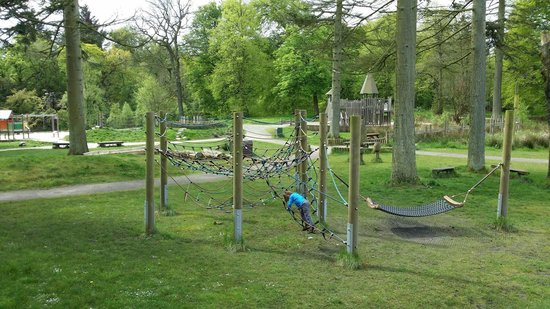

The Beavers and Cub Scouts are holding their final meeting of the session at Polkemmet Country Park tomorrow, Thursday 28th June 2019.

We ask that the Cubs and Beavers - from BOTH Beavers groups - are dropped off at Polkemmet at 6 pm and collected once again at 7.30 pm.  We intend gathering at and departing from the car park nearest to the adventure play area – close to the park’s Visitor Centre.  Parents may of course wish to consider sharing transport if convenient.

Everyone is asked to wear their normal Thursday night uniform but wear sensible outdoor footwear and with the weather forecast looking good, perhaps applying some sunscreen prior to arriving at Polkemmet would be recommended.  Drinks and a snack will be provided during the evening.

**As mentioned, the weather forecast is looking very good so it looks unlikely we'll need to revert to a normal Thursday night programme with the usual meeting times at Brucefield Church Halls.**

