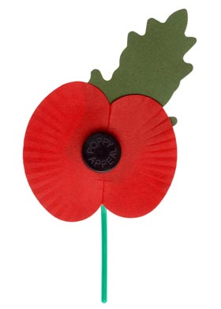

The above parade and service takes place tomorrow.

As intimated in the recent letter, we have always considered this to be an ‘optional’ parade for members as it can be a very cold day and the service deals with sombre themes. 

However, if your child wishes to do so, they would be made very welcome for this very significant parade and service.

**Due to building work at the Burgh Halls, this year we are assembling in the car park behind Tastes Café, Armadale Road at 10.15 am on the Sunday morning.** 

We will parade from Armadale Road, at around 10.30 am, to the Cenotaph at Whitburn Community Centre. After a short service at the Cenotaph, all participants will move over to Whitburn South Church for the Remembrance Service.  The parade will then return to the Masonic Hall for refreshments and a snack.  Proceedings should finish around 1.15 pm. If preferred, parents can collect their children at the end of the parade (around 12.45 pm).

All members in attendance are asked to wear their uniform as well as smart trousers. If possible, warm underclothes should be worn.

