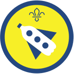

Hello everyone. We hope everyone is well.

Since it seems we are all going to be spending more time indoors for the next wee while, I thought an appropriate first recommendation might be the BOOK READER ACTIVITY BADGE.

To gain this badge, Beavers need to:

1. Design a cover for your favourite book. Be able to tell us all why this book is your favourite.
2. Read at least six books. Books you have read on an e-reader count too.
3. Show that you know how to look after a book.
4. Make a bookmark and explain what bookmarks are for.

Or, if you're looking for something a bit more hands-on, how about trying the BUILDER ACTIVITY BADGE. To gain this badge, Beavers need to:

1. Design a model of something you would like to build. The design can be on paper or a computer.
2. Make a list of all the items you are going to need to build your idea.
3. Build your idea using the list of items you need. Your model could be made using building blocks, gears or recycled items such as toilet roll tubes or cardboard boxes.
4. Be able to explain to us all how long your build took to finish, if anything went wrong and what you would change if you built it again.

Remember, please keep all your hard work so you can bring it along when we return. Feel free to post any pictures, progress reports or comments on our Facebook page or e-mail them to info@7thwhitburnscouts.org.uk.

If none of these badges are of interest, all the Beaver Scout Activity badges can be found at:

[https://www.scouts.org.uk/beavers/activity-badges/](https://www.scouts.org.uk/beavers/activity-badges/)

There's also a whole lot of activities at:

[https://www.scouts.org.uk/the-great-indoors/](https://www.scouts.org.uk/the-great-indoors/)

to be carried out indoors.

Good luck and get Scouting everyone!
