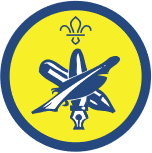
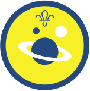

Hello everyone. We very much hope everyone is safe and well.

Week 2 and another Thursday may have sadly passed without a Beaver meeting but we are very keen that Scouting continues. So to add to last week's Activity Badges, here are another two that Beavers may wish to think about trying.

We thought this week we could start by getting our imaginations going by looking at the **Creative** Activity Badge.

**To earn this badge, Beavers need to:**

1. Do a performance. You could try one of these:
    - a poem
    - a puppet show
    - a short story
    - a dance
    - any other relevant activity
2. Try a craft. You could make one of these:
    - a card - Easter, birthday, Father's Day
    - seasonal item, like a decoration for a faith festival
    - glass painting
    - plate painting  
    - any other relevant activity
3. Construct something. You could do one of these:
    - make something that has moving parts, using recycled materials
    - use Lego or Meccano to build something
    - make something from clay or plasticine
    - make something from boxes and cartons
    - any other relevant activity
4. Use your imagination. You could do one of these:
    - draw a picture, or make a model or collage, of what the world might be like in 100 years
    - create a cartoon character and write a short comic strip telling a simple story
    - create a superhero and tell others what superpowers they have
    - any other relevant activity

Another Activity Badge to try could be the **Space** Activity badge.

**To earn this badge, Beaver Scouts need to:**

1. Be able to say what you can see in the night sky. It could be stars, the moon or planets.
2. Point out and name at least one constellation you can see.
3. Name the eight planets in our solar system and draw or make a model of one of the planets. You could use papier-mache to make your model, for example.
4. Find out about a space mission, an astronaut or a planet in our solar system.

We are always super-flexible when it comes to the "evidence" Beavers produce to earn any badge. As with all Scouting activities, we are just looking for everyone to "do their best".

Remember, please keep all your hard work so you can bring it along when we return. Feel free to post any pictures, progress reports or comments on our Facebook page or e-mail them to info@7thwhitburnscouts.org.uk.

If none of these badges are of interest, all the Beaver Scout Activity badges can be found at:

[https://www.scouts.org.uk/beavers/activity-badges/](https://www.scouts.org.uk/beavers/activity-badges/)

There’s also a whole lot of activities at:

[https://www.scouts.org.uk/the-great-indoors/](https://www.scouts.org.uk/the-great-indoors/)

to be carried out indoors.

Good luck, keep safe and keep Scouting everyone!
