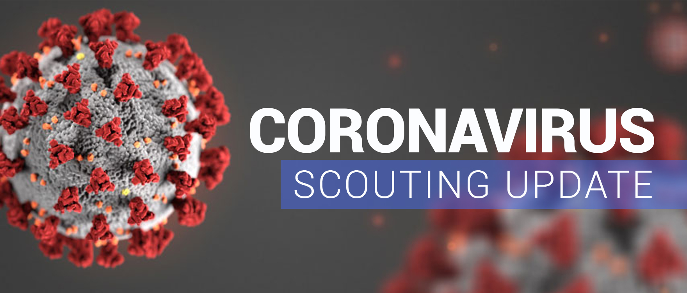

First, we hope everyone is safe and well during what continues to be a very challenging time for us all. 

Secondly, sincere apologies for the lack of updates in recent months.  Like so many, the Leaders of the Group have been simply trying to get through this period and busy adapting and coping with the new ways of working and living.

Normal Scouting, as we know it, has not been possible since mid-March.  The Beaver section offered on-line programmes via Zoom from April – June and all sections have posted various items of badge work on the Group’s website that can be completed independently.  The level of engagement for these activities has been low.  Which, we totally understand; what makes Scouting great is being with other Scouts.  “Virtual Scouting” just isn’t the same!

Indoor Scouting was possible for period, but the halls at Brucefield Church have been and continue to remain closed to users.  We are in regular contact with Brucefield but we still do not know when this situation will change.  Also, with West Lothian recently placed in Tier 4, indoor Scouting is not currently possible anyway.

The Leadership team have been broadly reluctant to hold face-to-face meetings for a number of reasons - declining weather at this time of year makes meeting outside difficult, concerns about the spread of COVID, concerns over the quality of programmes we are able to provide (both inside and out) due to all the necessary requirements when meeting and ensuring these are met and the complexity - perceived or otherwise - in the risk assessment process required by the Scout Association for all meetings.

COVID restrictions also mean that our annual and main fundraiser, the Scout Post, is not able to take place.  This will be the first time the Post has not run since it began in 1985.   As well as being a much used service by many in the community it also raises approximately £2,500 for Group Funds.  Clearly this, and the cancelling of bag packing at Morrison’s in August, puts a significant dent in our annual income. 

News of vaccines provide us all with hope that the COVID situation will improve, but it is clearly some time off before we get back to, if it’s possible, normality.  We will continue to monitor and review the situation carefully going forward and please be assured that everyone at the Scout Group cannot wait to get back to Scouting when it is possible and safe for us to do so.

If you have any comments, suggestions or just wish to make contact then we’d love to hear from you.  Please e-mail [johnston\_gavin@hotmail.com](mailto:johnston_gavin@hotmail.com) or drop us a message on our Facebook page. 

Please keep well and stay safe everyone.
