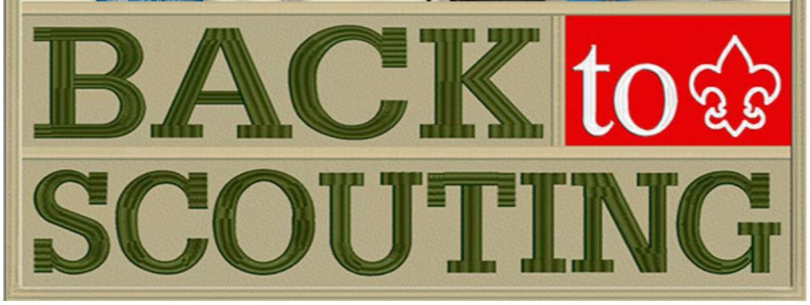

**Meetings for all sections will resume on the week beginning 6**th **September.  Scout meetings (for young people aged 10 1/2 to 14) are on Tuesdays from 6.30 - 8.30 pm; Explorer Scouts (14 - 18 year old) meet also on Tuesdays from 7.30 - 9.30 pm; Beaver Scout meetings (5 3/4 - 8 year old) at 5.30 - 6.30 pm and Cub Scout meetings from initially from 6.45 - 7.45 pm both on Thursday evenings.** 

**All meetings take place at Brucefield Church, East Main Street, Whitburn.   We provide a wide range of fun activities and the opportunity to development many life skills.** 

**Come along to any meeting, visit our website at** [www.7thwhitburnscouts.org.uk](http://www.7thwhitburnscouts.org.uk/) **or contact Gavin Johnston on 01501 773519.**  

