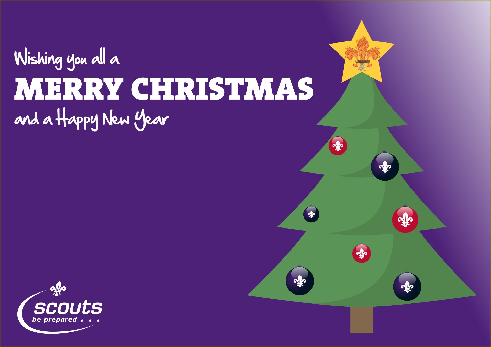

Section meetings for the year have now stopped. It has been absolutely fantastic being back to face-to-face meetings this year, since September. One of the most pleasing aspects has been seeing how many of our young people have returned to us after such a long time away.

You will be aware that in recent days a number of COVID restrictions have been, or will be, reintroduced. At the moment, the Scout Group is planning on meetings resuming for the Cubs and Beavers on Thursday 6th January and Scouts and Explorers on Tuesday 11 January 2022. We will of course keep you informed of any changes. **Please note that Cub meeting times will return to 6.15 - 7.45 pm.**

Thank you so much to everyone who helped with the Scout Post this year - whether delivering promotional leaflets and/or Christmas cards. We delivered 4,900 cards and raised the fantastic sum of £1,400. This money will be used to pay the membership fees, for all our young people, to the Scout Association.

And thank you also to all Beaver Scouts who raised the terrific sum of £62 for Children in Need. This was part of their Personal Challenge badge and involved filling Smartie tubes.

Finally, please can we wish everyone a very happy Christmas and best wishes for the New Year. Thank you for all your support in 2021 and we very much look forward to 2022.

Please stay safe and well everyone.

